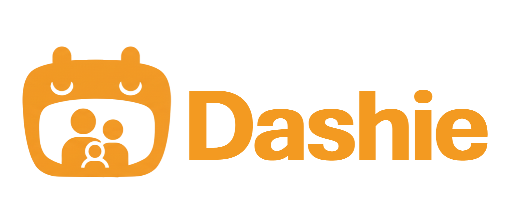

  

<h3 align="center">Voice &amp; AI for Home Assistant — plug and play.</h3>

  

---

Great voice AI for Home Assistant usually means hours of wiring up models,
speech engines, tools, and prompts. Chickadee ships it tuned and working:
install one add-on and every Assist device in your house gets an assistant
that actually understands — "turn off everything downstairs except the porch
light" — and answers back in a natural voice.

It works with the voice hardware you already have (HA Voice Preview Edition,
ESPHome satellites, tablets, wall dashboards), and it runs on **your** terms:
use Chickadee Cloud and skip the setup entirely, bring your own AI key, or
run everything on your own hardware.

## Install

**1.** Click the button above — or add this repository by hand:
Settings → Add-ons → Add-on Store → **⋮ → Repositories** → paste
`https://github.com/jwlerch78/dashie-ha-console`

**2.** Install **Chickadee** from the store, then press **Start**.
It sets everything else up for you — including the Chickadee integration.

**3.** Open the **Chickadee** panel in your sidebar and click
**Restart Home Assistant** when the banner asks.

**4.** After the restart: Settings → Devices &amp; Services →
**Configure** on the discovered Chickadee card. Done — you now have a
"Chickadee" voice assistant available to every Assist device.

## Pick how it thinks

Choose in the Chickadee panel, switch any time:

| | |
|---|---|
| **Cloud** | Best quality, zero setup. Sign in and go — metered credits, no subscription. |
| **Hybrid** | Cloud AI with free, private voice engines on your own hardware. |
| **Local** | Your own AI model and voice engines. Nothing leaves your network. Free. |

Going local? A language model needs somewhere real to run — a GPU or
Apple-silicon box on your network answers in seconds, a small CPU-only HA box
takes minutes. Cloud and Hybrid exist for exactly that case.

## What you get

- **Real smart-home control** — multi-step commands, in one breath, across
  your Assist-exposed devices.
- **Answers, timers, conversation** — in a natural voice, not a beep.
- **Smart context** — Chickadee sends the AI what your question needs, not
  your whole house. Faster, cheaper, more accurate.
- **Any AI, any engines** — local models (Ollama, llama.cpp, and friends) or
  your own key for Gemini, OpenAI, OpenRouter; Whisper for ears,
  Kokoro/Piper for voice.

## Works with your gear

| Satellite | Chickadee pipeline | Wake word (screen off) | Realtime conversation |
|---|---|---|---|
| **HA Voice PE / ESPHome satellites** | ✅ | ✅ on-device | ❌ |
| **[Dashie](https://dashieapp.com) tablets / TV** | ✅ | ✅ on-device | ✅ |
| **Fully Kiosk / browser dashboards** | ✅ via satellite cards | ⚠️ card-dependent | ❌ |

Wake word runs wherever it makes sense for your hardware: on-device, or in
the pipeline for satellites that can't do it locally (experimental — we're
building it). Chickadee ships custom microWakeWord models (`hey_dashie`,
`chickadee`) that run unmodified on the standard `wyoming-microwakeword`
add-on, and supports the community ones (Okay Nabu, Hey Jarvis, Alexa)
referenced by name from the official repo — use ours, use theirs, or bring
your own. Realtime speech-to-speech (interrupt it mid-sentence, keep
talking) needs more than HA's standard pipeline; today the Dashie app is the
one satellite we know of that supports it.

## Free, open, and how the lights stay on

Chickadee is AGPL-3.0 and fully self-hostable — every capability works with
your own engines and keys, forever. **Chickadee Cloud** is the optional
convenience: hosted AI, ears, and voices, metered by usage with no
subscription. That's the whole business model, in the open.

Chickadee is built and operated by the makers of
[Dashie](https://dashieapp.com), the family dashboard for Home Assistant.
The full relationship — who develops what, why some wire values say
`dashie`, how the money works — is written down in
[PROVENANCE.md](PROVENANCE.md), and exactly what data leaves your box in
each mode (local: nothing) is in [PRIVACY.md](PRIVACY.md).

It's also **heavily AI-assisted, human-reviewed**, by one maintainer, on top
of a voice stack that has been running in real households since 2025 — which
is why the commit history is short and fast. Said here rather than only in
[PROVENANCE.md](PROVENANCE.md), because you shouldn't have to find it. Judge
the code; issues and corrections welcome.

One maintainer also means limited review capacity: during the beta, **bug
reports and feature requests are what help, and external code contributions
aren't being accepted yet** — see [CONTRIBUTING.md](CONTRIBUTING.md) for what
does help and why there's a CLA when that changes.

## For developers

- [Add-on internals &amp; option reference](dashie-ha/DOCS.md) — the deeper
  technical story, engine recipes, and every config option
- [Integration source](https://github.com/jwlerch78/chickadee-integration)
  (HACS / manual install for people who'd rather manage it themselves —
  the add-on's auto-installer never touches a HACS-managed copy)
- [`tools/`](tools/) — maintainers' headless dev rig (set `DASHIE_HA_HOST`)

## License

[AGPL-3.0](LICENSE)
